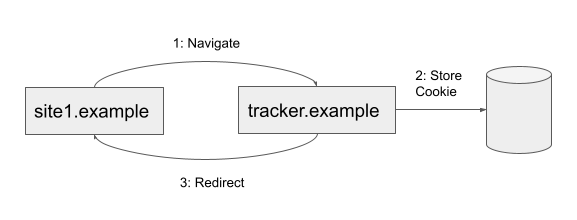
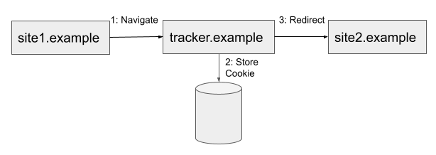
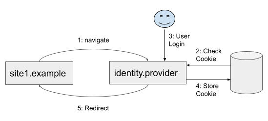
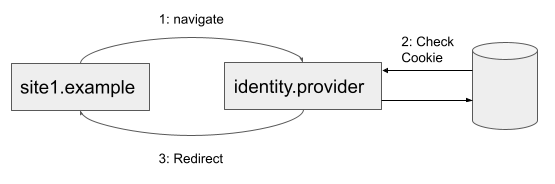

# Bounce Tracking Mitigations Explainer

September 2022 - Ben Kelly, Brian Lefler

# Introduction

With browser vendors now actively working to remove third-party cookies from the web, some platform trackers are moving to bounce tracking.  This technique involves navigating to a tracker domain at the top level of a browser tab, setting or reading a first-party cookie, and then quickly redirecting away using a request that encodes the value of that first-party cookie.  Sometimes the redirect is back to the original page and sometimes to a new site.  In either case, bounce tracking semantically functions like setting a third-party cookie.

This technique is technically similar to use cases like federated login.  They both use redirects that access first-party state.  The difference, however, is that federated login performs an explicit action that the user has chosen to benefit them.  Generally bounce tracking is not something the user is aware of or has chosen to do, and it has questionable value for the user.  Based on this difference we consider use cases like federated login "supported" and something to be preserved while mitigating bounce tracking.

This explainer outlines a proposal for mitigating the privacy impact of bounce trackers.

Safari, Firefox, and Brave have already shipped various bounce tracking mitigations.  These are summarized in a PrivacyCG [draft report](https://privacycg.github.io/nav-tracking-mitigations/#deployed-mitigations).

# Goals

*   Reduce or eliminate the ability of bounce tracking to [recognize people across contexts](https://w3ctag.github.io/privacy-principles/#hl-recognition-cross-context).
*   Prevent stateful bounces from simulating third-party cookies when third-party cookies are disabled, either due to browser policy or user settings.
*   Avoid breaking supported use cases valued by the user that are implemented using stateful redirects.
*   Mitigate the impact of short-lived domains that may not be adequately addressed by other privacy interventions that rely on blocklists.
*   Avoid using block or allow lists.  This is discussed further in the alternatives section below.

# Non-Goals

*   This proposal largely only adds value when third-party cookies are disabled.  For the most part third-party cookies can be used to achieve the same results as bounce tracking.  Therefore it is not a goal to enable these mitigations when third-party cookies are enabled.
*   This proposal does not mitigate behavior of sites with a great deal of first-party activity.  It is technically difficult to distinguish first-party activity associated with a supported bounce use case from first-party activity unrelated to a redirect bounce.  Similar bounce mitigations shipped in other browsers have the same limitations.  As such, this proposal by itself is not a complete solution and must work with other proposals to constrain sites with significant first-party activity.  Those other proposals are outside of the scope of this document.

# API / Browser Behavior

This proposal does not have any additional API surface, but instead changes the behavior of the browser.

At a high level the proposal is for the browser to automatically delete storage for a site (eTLD+1) when both of the following are true:

1. The browser believes that state has been stored during a redirect bounce.
2. The browser has not had any signals that the user is performing a supported use case on the site (eTLD+1).

These definitions are a bit vague and clarifying them will be a key part of this effort.  With that said, we can talk about the types of information and signals that may be used to make these determinations.

A stateful redirect bounce might be identified based on:

*   Time spent on a site before navigating away.
*   Whether the navigation away was programmatic (redirect or setting ``window.location``) vs a user-initiated navigation.
*   Whether the site wrote to cookies or any other storage API before navigating away.

A site being used for supported use cases might be identified based on:

*   Whether the user has ever had an interaction on the site.
*   Length of time the site has been in the foreground and visible to the user.
*   Whether storage already exists for the site before the redirect bounce occurs.
*   How much the user has [engaged](https://www.chromium.org/developers/design-documents/site-engagement/) with the site.

Again, if a stateful bounce is detected and there are no signals that a supported use case is occurring then the proposal is that the browser should delete the site's storage.

In this proposal, stateful bounce detection would be applied against all sites without consulting any block or allow list.

# Key Scenarios

## Redirect Bounce to Simulate an Unpartitioned Third-party Cookie

In this scenario we are interested in sites that navigate or redirect themselves to a tracker domain and then back to the original site.  Identifying information is often encoded in the URLs or Referer headers.  The tracker domain is then able to access storage to implement what is effectively an unpartitioned third-party cookie.  The tracker domain does not have any first-party relationship with the user.

This technique also bypasses privacy settings and UI that already exist in the browser.  If the user has disabled third-party cookies in settings then they have clearly signaled they do not want third-party cookie semantics.  This kind of bounce tracking allows sites to ignore this user choice for increased privacy.

This tracking scenario will be mitigated by this effort by wiping the tracker domain's storage.

## Redirect Bounce on an Outgoing Navigation

Another tracking scenario involves a source site redirecting all outgoing links through a tracker domain.  Again, the tracker domain is able to access first-party storage in this scenario and has no first-party relationship with the user.

This tracking scenario will be mitigated by this effort by wiping the tracker domain's storage.

## Federated Authentication

Federated authentication is a very important scenario we must consider.  This use case occurs when a user clicks on a "Login with &lt;Identity Provider>" type button on the web; e.g. Facebook, GitHub, Google, etc.

In general federated authentication follows the OpenID connect standard.  The source site navigates to the identity provider which then tries to authenticate the user.  Upon success the identity provider redirects back to the original site with a token in a query parameter.  See the diagram below:

This is a use case that we consider supported and we would like to avoid breaking.  Unfortunately, this flow looks extremely similar to the "redirect bounce to simulate a third-party cookie" scenario above.  The main difference is that the user is expected to interact with the identity provider to login, either as part of the redirect flow or during another first-party visit.  This is why our algorithm for determining if deletion should occur looks for this kind of signal.

## Single Sign-On

A similar redirection flow happens when a site uses single sign-on (SSO).  In this case the user expects to log in with the identity provider once and then be automatically logged-in for all visits on other sites.  In this case there is no interaction during the redirected navigation, but instead it happened during a previous first-party visit to the identity provider.

This is another use case that we wish to support without any breakage.  Therefore our criteria for deleting storage must consider interactions or engagement outside of the redirection flow itself.

## Payments

There are a wide variety of payment flows in use on the web today and we would like them to continue functioning.  Many of them use redirects, but do not rely upon client-side state to function.  Many of them also include direct user interaction or other signals that the user is taking an intentional action.  Therefore we believe the majority of these flows will not be broken by this effort.

# Considered Alternatives

## Blocking Storage

An alternative to deleting storage after-the-fact is to block storage when a navigation occurs.  This would be an improvement in that it would prevent any tracking from occurring for any amount of time.

The downside, of course, is that blocking storage would be extremely breaking for many websites if implemented on all navigations.  Perhaps it could be scoped to sites where the browser has observed a large number of bounces previously.

Even if narrowly scoped to sites with bounces, however, blocking storage would break supported use cases that we have a goal to keep working.  Federated authentication would simply break with little recourse.

## Ephemeral Storage

Another alternative would be to provide storage, but make it ephemeral without any persistence.  This would have similar benefits to blocking storage in that tracking could not occur for any amount of time.

Again, however, ephemeral storage is also breaking for our target use cases.  Federated authentication would not be able to persistently record that the user is logged in, forcing them to authenticate every time.

A variant on ephemeral storage would be to attempt to "commit" the ephemeral storage to full persistent state once an event occurs signaling that a supported use case is occurring, such as a user interaction.  This is appealing, but it seems riskier to spec and implement than what we’re proposing here.  There would be a great deal of complexity when it came to potentially merging the ephemeral view of state with the normal first-party state that may be getting mutated at the same time from a different tab.  The risk of browser bugs, poor interoperability, and unpredictable behavior seem high with this approach.

## Block/Allow Lists

Another option would be to integrate block or allow lists into the algorithm.  Only sites on the block list would be considered as possibly performing stateful bounces.  Sites on the allow list would never be considered as performing stateful bounces.  For example, known federated authentication identity providers could be placed on the allow list.  This kind of approach would allow us to perhaps be more aggressive with blocking storage altogether.

These kinds of lists could be hand-curated or algorithmically generated.  Where possible, however, we would like to avoid these kinds of lists.

Hand-curated lists can have a negative impact on the web by choosing "winners and losers".  We may be able to have more aggressive mitigations if we enshrine the current identity providers in an allow list, but this could become a significant barrier to entry for new identity providers in the future.

In contrast, algorithmically generated lists can adapt over time to avoid the "winners and losers" problem, but instead introduce a different problem.  With this kind of list web developers and users end up experiencing inconsistent behavior on the web.  Something that works today may fail tomorrow.  We would like to avoid this kind of behavior when possible.

Finally, both kinds of lists are susceptible to evasion by smaller operators who can simply register new domains when their older domains are blocked.  Algorithmic lists can try to adapt to this by mutating faster, but that comes at an increased cost of instability in behavior for developers and users.  One of our goals for this effort is to have mitigations that avoid this type of evasion, so this is a significant weakness.

## First-Party Sets

Currently we plan to consider storage and activity at the site level, as defined by eTLD+1.  An alternative would be to use [first-party sets](https://github.com/privacycg/first-party-sets) instead of site, deleting storage and assessing activity across all related sites within a first-party set.

Right now there does not seem any significant benefit to using first-party sets when performing bounce tracking mitigations.  It would not protect any additional supported use cases.

Therefore we do not plan to integrate first-party sets with our bounce tracking mitigations.

## Crawl-Based Analysis

Another approach to this problem would be to crawl the web and analyze stateful bounces that are seen.  This could allow us to classify some redirects as potentially tracking and others as not tracking.  For example, if a site is only ever redirected to from a single other site, then it can likely be disregarded as an unlikely tracking bounce.

This approach can be powerful, but has some downsides we wish to avoid.  In particular, this kind of analysis can cause behavior on the web to change over time.  A redirect that functioned normally before can suddenly start triggering mitigations if the crawler detects new information.  This makes the web platform more difficult to develop for.  Web developers cannot reliably test that their sites work and then have the confidence they will continue to work.

For this reason we are not currently pursuing this approach, but acknowledge it may be a useful technique to consider if necessary in the future.

# Privacy and Security Considerations

This feature will likely need to store information about sites that have a user interaction, some amount of view time, or [engagement](https://www.chromium.org/developers/design-documents/site-engagement/).  This information is not directly exposed to sites, however, it can be indirectly observed.  For example, if `tracker.example` reports back its oldest existing state to `site1.example`, then `site1.example` could infer that `tracker.example` has had an interaction.  If it does not report any long-lived state, however, then `site1.example` could infer that the state was wiped.

In addition, there are potential scenarios where the existence of an interaction could be accessed through existing XS leaks in the platform.  Consider a scenario where a target site has an existing endpoint that causes an automatic redirect that triggers the bounce tracking mitigations.  An attacker could use existing XS leaks to determine if any logged-in state is present on a target site and then look to see if that state disappears after triggering the bounce.

The information leak from tracker to site does not seem very significant.  It is not new information because this kind of data can be tracked and shared today.

The cross-site adversarial information leak is more concerning.  Solutions designed for this effort should take this threat into account and attempt to mitigate it.  For example, delaying or fuzzing the timing of storage wiping could lessen the impact of the leak.  Ultimately, though, it may be necessary to weigh the cost of this 1 bit information leak against the gains in mitigating bounce tracking.

Another threat that should be considered by any solution is the possibility that an attacker will trick a user into visiting an existing redirect endpoint on a site that they care about and somehow trigger their storage to be deleted.  The current plan, however, is to already look at signals that a user cares about a site for legitimate use cases, in order to avoid wiping data they care about.  This threat just puts more weight on getting these signals correct.

Otherwise this effort does not store or expose any new types of information.  It does not create any new cross-origin communication or storage capabilities.

There is some implementation complexity to be aware of when wiping storage.  The browser must be careful not to wipe storage out from under a site actively using it.  This could lead to poor interop and broken web sites.

# Open Questions

Some issues that we’d like to discuss:

1. [Are there non-tracking uses of redirect bounces not enumerated in the explainer?](https://github.com/wanderview/bounce-tracking-mitigations/issues/1)
    1. If so, are there new signals that can be used to exclude these uses from impact?
2. [What signals best indicate that a redirect is part of a supported use case?](https://github.com/wanderview/bounce-tracking-mitigations/issues/2)

# Stakeholder Feedback / Opposition

Pending feedback after publication.

# References and Acknowledgements

Safari, Firefox, and Brave have all shipped some form of bounce tracking mitigation.  Each browser currently has a different approach to mitigation.  A description of these features are summarized in a PrivacyCG [draft report](https://privacycg.github.io/nav-tracking-mitigations/#deployed-mitigations).  Specifically, this explainer most closely aligns with the following shipped features:

*   Brave's [unlinkable bouncing](https://brave.com/privacy-updates/16-unlinkable-bouncing/) uses ephemeral storage for known bounce trackers if there is not already first-party storage for the site.
*   Firefox’s [redirect tracking protection](https://developer.mozilla.org/en-US/docs/web/privacy/redirect_tracking_protection) deletes storage for sites on the disconnect.me list if there has not been a first-party interaction within the last 45 days.
*   Safari expires or [deletes storage](https://webkit.org/blog/8311/intelligent-tracking-prevention-2-0/#:~:text=Protection%20Against%20First%20Party%20Bounce%20Trackers) on sites after client-detected bounce tracking if there is not an interaction within 1 to 7 days.

We want to acknowledge and thank the other browser vendors for all the work they have done on this topic.

In addition we are thankful for the work being done in the [PrivacyCG](https://privacycg.github.io/nav-tracking-mitigations/) on this topic.

Thank you for design input, feedback, and review from:

* Jeffrey Yasskin
* Joshua Hood
* Kevin Berlin
* Ryan Tarpine
* Stefan Popoveniuc
